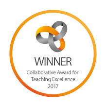

# Community

There is a large and growing community of STACK users.  This includes large universities with many teachers and thousands of students, through to smaller setups.  STACK is in regular use in English, Finnish, Swedish, Japanese, German, Spanish and Portuguese.  If you are using STACK please let us know!

A demonstration server is available in Edinburgh:  [https://stack.maths.ed.ac.uk/demo](https://stack.maths.ed.ac.uk/demo)

In 2017 the STACK project was awarded a Collaborative Award for Teaching Excellence.

### How can I contribute?

STACK is a community project and contributions are welcome in many ways.

* Helping colleagues write questions, and use online assessment is a good place to start.
* Contributing to the documentation and examples.
* Undertaking projects with your students and sharing the results.
* Contributing sample questions and question banks.
* Translating the system and sample materials.
* Documentation and examples.

Contributions to the code base are very welcome.  This is more difficult, but do contact the developers with ideas.

### How do I keep up to date with announcements about STACK?

We will make announcements about progress and developments with STACK on the [Moodle maths tools](http://moodle.org/mod/forum/view.php?id=752) forum. 
For the STACK Question Plugin see https://docu.ilias.de/goto_docu_cat_4119.html.

### How do I report a bug?

Bug reports are always very welcome.  Please try to make sure it is really not a bug with your question!  Where possible, please export a minimal question and a clear description of how to recreate the bug.  Issues such as this can be reported on [GitHub](http://github.com/maths/moodle-qtype_stack/issues).
For the STACK Question Plugin see https://docu.ilias.de/goto_docu_cat_4119.html.

### How do I request a new feature?

Please look at the ideas we have for our [development track](../Developer/Development_track.md) and [future plans](../Developer/Future_plans.md).  If your request does not appear here, then please email the developers to discuss it.  Alternatively, you are very welcome to start a new issue on [github](http://github.com/maths/moodle-qtype_stack/issues) to discuss it.
For the STACK Question Plugin see https://docu.ilias.de/goto_docu_cat_4119.html.

### How do I submit my code changes?

Submit a pull request [https://github.com/maths/moodle-qtype_stack](https://github.com/maths/moodle-qtype_stack), or one of the other plugins. If you are not yet familiar with git, please talk to us about your changes, and we will help. Actually, it is probably a good idea to talk to us about proposed changes before you make them in any case.

### How do I share my experiences using STACK?

Please do research and publish your experiences of using STACK with students.  A list of [publications](Publications.md) is available.

## User Community

### Exchange of questions
There is a database of STACK-questions at https://db.ak-mathe-digital.de/domain. Right now, there are over 400 STACK-questions, in many different languages. A filter simplifies the search for specific questions. Questions can easily be exported as xml-files and as such can be used in Moodle as well as in ILIAS. Everybody can contribute their own questions. 

### Meetings
The 1st international STACK Conference took place on the 15th and 16th of November 2018 in Fürth at the Friedrich-Alexander-Universität Erlangen-Nürnberg. Further information and slides at https://www.stack-konferenz.de/.

### Groups
Groups of people who use STACK. You are welcome to join, ask questions and participate.
* [SIG Mathe+ILIAS](https://docu.ilias.de/goto.php?target=grp_5183)
* [Arbeitskreis Digitale Mathematik-Aufgaben in der Hochschullehre](http://www.ak-mathe-digital.de)
* STACK professionals Network.  In 2022 we created a nework of colleagues working on STACK questions.

# User list

The following institutions made use of previous versions of STACK.  If you are actively using STACK and would like to be listed below then please contact the developers.

School of Mathematics, The University of Edinburgh
: The home of STACK. Contact [Chris Sangwin](mailto:c.j.sangwin@ed.ac.uk).

School of Mathematics and Statistics, The Open University,
: Contact [Tim Hunt](mailto:t.j.hunt@open.ac.uk) and [Tim Lowe](mailto:tim.lowe@open.ac.uk)

School of Science, Aalto University, Helsinki, Finland
: Contact Matti Harjula and [Antti Rasila](http://math.tkk.fi/en/research/matta/)

Department of Mathematics Education, Loughborough University
: Contact [Ian Jones](mailto:I.Jones@lboro.ac.uk)

School of Informatics and Sciences, Nagoya University, Japan
: Contact [Yasuyuki Nakamura](mailto:nakamura@nagoya-u.jp)

Ja STACK Community
: Contact [Ja STACK.org](http://ja-stack.org/)

Polytechnic Institute of Leiria, Leiria, Portugal
: Contact [Rui Paiva](mailto:rui.paiva@estg.ipleiria.pt)

School of Computing, Information and Mathematical Sciences, The University of the South Pacific
: Contact [Dhiraj Bhartu](mailto:dhiraj.bhartu@usp.ac.fj)

Gymnasium Himmelsthür, Hildesheim, Deutschland
: Contact [Frank Schütte](mailto:fschuett@gymnasium-himmelsthuer.de)

Universidad Michoacana de San Nicolas de Hidalgo
: Contact [Victor Hugo Huerta](mailto:v2hugo@gmail.com)

e-MAIO project, Coimbra Institute of Engineering, Portugal
: Contact [e_MAIO@isec.pt](mailto:e_MAIO@isec.pt)

Maseno University, Kenya
: Contact [Michael Oyengo](mailto:obiero@live.de)

IDEMS International
: Contact [Santiago Borio](mailto:smborio@idems.international)
