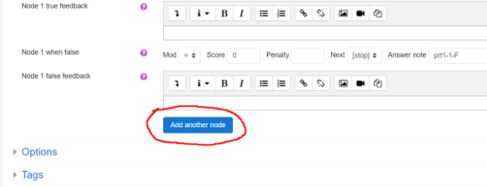

# 問題作成クイック・スタート・ガイド 3：フィードバックを改善する

[1 - 基本的な問題](Authoring_quick_start_1.md) | [2 - 問題変数](Authoring_quick_start_2.md) | 3 - フィードバックを改善する | [4 - ランダム化](Authoring_quick_start_4.md) | [5 - 問題のテスト](Authoring_quick_start_5.md) | [6 - 複数解答欄問題](Authoring_quick_start_6.md) | [7 - 数式簡略の無効化](Authoring_quick_start_7.md) | [8 - 問題のインポートと小テスト](Authoring_quick_start_8.md)


問題作成クイック・スタート・ガイドのこのパートでは、フィードバックの改善について扱います。次のビデオでそのやり方を説明します：

<iframe width="560" height="315" src="https://www.youtube.com/embed/l6QAMmUA5Pk" frameborder="0" allowfullscreen></iframe>

## はじめに
最後のパートでは,質問変数を使い始めました。具体的には,被積分式を表す変数`exp`を定義し,先生の答えを表す変数taを定義しました。そして,\(\int 3(x-1)^{-4}dx\)を求めさせました。

Int answer テストは,積分の定数に対してどのような変数名でも受け入れます。例えば,`-(x-1)^(-3)+k` と入力してみてください。システムはこれを正解とします。また,学生が積分の定数を忘れたり,誤って代わりに微分した場合、標準的なフィードバックを与えます。これを試すには,`-12*(x-1)^(-5)`とタイプしてみてください。自動フィードバックを学生に見せたくない場合は,潜在的な応答ノードでQuiet オプションを選択してください。

結果のanswerノートは,特定の結果に対して付けられる名前です。STACKは,潜在的な回答ツリー,ノード番号,ノードの結果に関する情報で,これらを自動的に生成します。

## 考察
STACKで学生の答えをチェックするとき,先生は "学生の答えを正解/不正解にする数学的特性は何か "を問わなければいけません。私たちの場合,これらの質問は以下を含みます:

- 生徒の答えは非積分関数の不定積分ですか?
- 生徒は積分の定数を適切な形で持っていますか？

組み込みの`int`型解答テストがこれらの質問に答えるので,先生はすべての統合問題に対してそのためのコードを書く必要はありません。

次に,教師は "生徒が何を間違う可能性があり,その答えとして何が得られるのか？"を問わなければいけません。この2番目の質問はより難しいです。その答えは,経験を通じて,または前もって診断的な質問をすることによって得られるかもしれません。年度ごとにSTACKの質問に対する生徒の回答を見直し,経験に照らしてより良いフィードバックを組み入れると良いでしょう。

## フィードバックをさらに強化する

生徒が犯しそうなミスごとに,解答例を作成することができます。例えば,生徒が解答を展開したままにしておくとします。これはもちろん正しい答えですが、不必要に答えを展開しないように生徒を指導したいです。学生が最終解答を因数分解した形で残したかどうかをテストする別のノードを作成しましょう。これはもう1つの潜在的な応答ノードを追加することで行います。



応答候補ツリーに移動し,`[別のノードを追加]`をクリックします。次にノード 1 の `真の場合のノード1` ブランチで `次のノード` を `Node 2`に変更します。ノード2を入力すると、学生が正しい答えを答えてください。これを確立するために[強相対単位解答テスト](/Authoring/Answer_Tests/index.md)を使用する必要があります。これは評価対象と評価基準が等価であることと,評価対象が因数分解されていることの両方をテストします。この場合,我々はすでに生徒の解答が教師先生の解答と等価であることを知っています（Intのベターテーラードアルゴリズムを使用）。したがって,私たちは生徒の答えをそれ自身に対してテストするだけで良いのです。

フォームをアップデートすることにより、ノード2は、
```
評価関数 = 強相対単位
評価対象 = strip_int_const(ans1,x)
評価基準 = strip_int_const(ans1,x)
オプション = x
```
STACKは,学生が使用した可能性のある積分定数を削除するstrip_int_const関数を提供する。オプションで変数を指定する必要があります。

`真`と`偽`の結果が点数を変えないようにしてください。デフォルトではそれぞれ+0と-0に設定されます。点数を変更しないことで、学生が拡大形式で答えても罰を受けないようにします。

強相対単位は自動的にフィードバックを返しますが、自分で書きたい場合は、QuietをYesに設定し、ノード2の偽のフィードバックに次のように入力します：

```
あなたの答えは因数分解されていません。正解していますが,括弧を展開する必要はないことを覚えておいてください。
```
あなたは,いくらでも多くの一般的な間違いをチェックしながら,潜在的な回答ツリーを拡大し続けることができます。その他の回答テストについては[ドキュメント](/Authoring/Answer_Tests/index.md)を参照してください。

## 一般的なフィードバックを追加する

一般的なフィードバックは問題の正誤に関わらず,すべての学生に表示されます。ここは完全な解答を追加するときに活用してください。

# 次のステップ

これでSTACKで特定のフィードバックを作成できるはずです。

##### 問題作成クイック・スタート・ガイドの次のパートは[ランダム化](Authoring_quick_start_4.md)についてです。