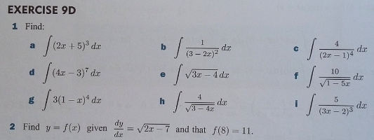

# 問題作成クイック・スタート・ガイド2：問題変数

[1 - 最初の質問](Authoring_quick_start_1.md) | 2 - 問題変数 | [3 - フィードバック](Authoring_quick_start_3.md) | [4 - ランダム化](Authoring_quick_start_4.) | [5 - 質問テスト](Authoring_quick_start_5.md) | [6 - マルチパートの質問](Authoring_quick_start_6.md) | [7 - 単純化](Authoring_quick_start_7.md) | [8 - クイズ](Authoring_quick_start_8.md)


問題作成クイック・スタート・ガイドのこの部分では問題変数の使用について扱います。次のビデオでそのプロセスを説明していますので,ご覧ください。：
<iframe width="560" height="315" src="https://www.youtube.com/embed/SFo3MBkyWVQ" frameborder="0" allowfullscreen></iframe>

## 例題

この例では,簡単な積分の問題を扱います。下記は典型的な練習問題です。



( _Advanced Mathematics for AS and A level 2_ (A-level mathematics), Haese Mathematics (2018) [978-1-925489-32-3](http://www.haesemathematics.com/books/advanced-mathematics-2-for-a-level) より許可を得て転載)

\(\int 3(x-1)^{-4} \mathrm{d}x\)を求める問題に注目します。新しいSTACK問題を作成します。前と同じように,問題に「積分の例」のような**問題名**を付けます。

### 問題変数の使用

次のステップは問題文を追加し,教師の答え `-1*(x-1)^(-3)+c` を `正解` フィールドと `ポテンシャル・レスポンス・ツリー` に追加することです。しかし,式と模範解答は通常複数回参照されますので,オプションの [問題変数](/Authoring/Variables.md#Question_variables) フィールドを使用して「問題変数」に割り当てるのが最も簡単です。

問題変数に以下を追加してください

```
exp: 3*(x-1)^(-4)；
ta: int(exp,x)+c；
```

問題変数のコーディングはMaximaに基づいています。特に,コロン `:` は変数に値を代入するために使われます。つまり,`a1` に `5` という値を代入するには,`a1:5` という構文を使います。一般的に,1文字の変数名は生徒が入力するためのものであるため,複数文字の変数名をつけるのがよい書き方です。なぜなら,作者が定義した複数文字の変数はデフォルトでは生徒が入力できないからです。さらに,各行の最後にセミコロンを追加することは任意ですが,よい書き方です。

不定積分を求めるために`int()`関数を呼び出して模範解答を決定するためにCASを使用していることに注意してください。CASが不定積分を決定するとき,積分定数は含まれないので,自分で追加しなければなりません。

これで，問題の残りを埋めるのがかなり速くなります．問題文に次のように書き加えてください：

	Find \(\int{@exp@} \mathrm{d}x\)
	[[input:ans1]] [[validation:ans1]]


ローカル変数 `exp` を定義し,その値を問題文に使っていることに注意してください。記号と `{@..@}` 記号で囲まれた値には違いがあります。フィードバックも含め,問題文中のテキストベースのフィールドはすべて[CAS text](/Authoring/CASText.md)です。これは数学が挿入できるHTMLです。LaTeXは `(.. \)` の間に置かれ,CAS式（変数を含む）はマッチする `{@..@}`の間に置かれます。CAS式は問題変数の文脈で評価され,LaTeXとして表示されます。

ここでは`{@exp@}`を使用しているため,ユーザは質問がインスタンス化されたとき,画面上 に`exp`の値を見ることはありません： \(\frac{3}{(x-1)^{-4}}\)

入力 `ans1` で,`正解` を変数 `ta` に指定する。

ポテンシャル・レスポンス・ツリーでは,`評価関数` を `代数等価` に設定し,`評価対象` を `ans1` に設定し,`評価基準` を `ta` に設定してください。

問題変数は時間の節約になり,将来的に質問の内容を簡単に変更できるので,頻繁に使用することをお勧めします。

# 次のステップ

これでSTACKで問題変数を使えるようになりました。

#### オーサリングクイックスタートガイドの次のパートでは,[フィードバックの改善](Authoring_quick_start_3.md)について説明します。